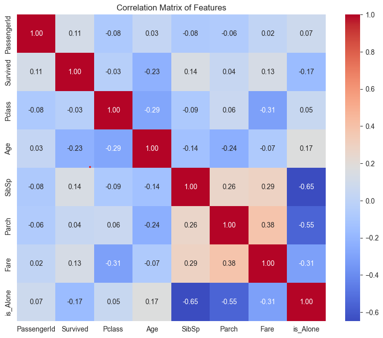
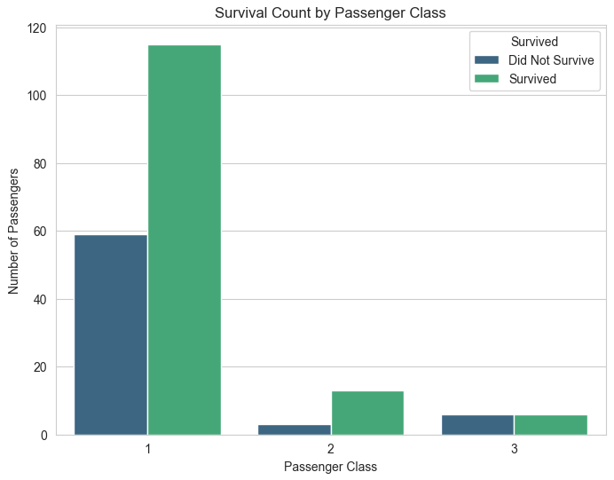
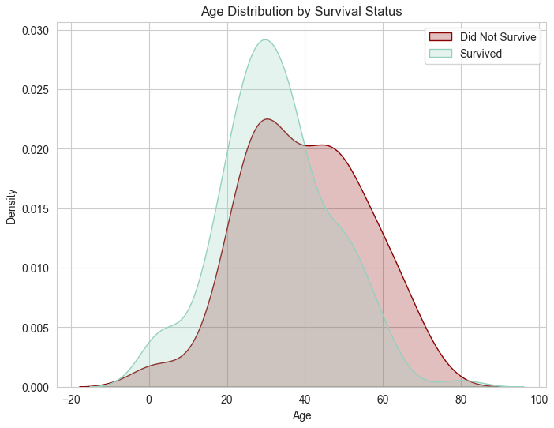
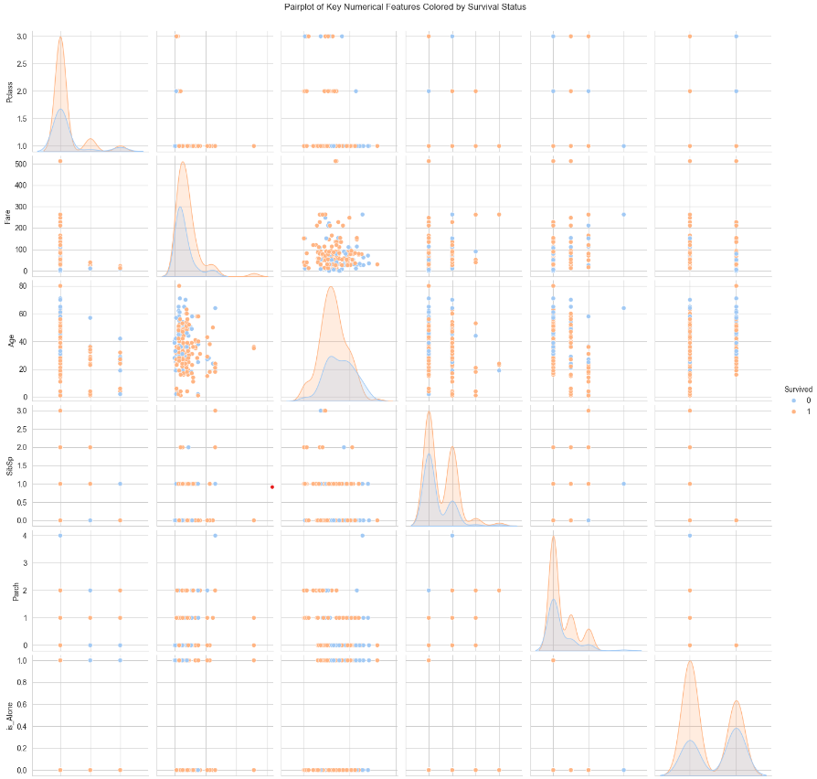

# Titanic Data Analysis

## Project Description
This project involves analyzing the Titanic dataset to uncover trends and insights about survival based on passenger demographics and other factors. It also demonstrates the use of three key machine learning models (Linear Regression, Logistic Regression, and K-Nearest Neighbors) to extract predictions and evaluate performance.

## Dataset
The dataset used for this project is the [Titanic Dataset](https://www.kaggle.com/datasets/yasserh/titanic-dataset).

### Note:
This project uses the Titanic Dataset from Kaggle, downloaded and processed independently. The dataset contains detailed information about Titanic passengers, including survival status, demographics, ticket fare, and class.

---

## Tools and Libraries
- Python
- Pandas
- NumPy
- Matplotlib
- Seaborn
- scikit-learn

---

## Key Features
1. **Data Preprocessing:**
   - Filled missing values for columns such as `Age` and `Embarked` using statistical methods (e.g., median, mode).
   - Created derived features such as `is_Alone` to analyze family-based survival trends.
   - Encoded categorical columns into numerical format using one-hot encoding.

2. **Visualizations:**
   - Heatmap to analyze correlations between features.
   - Violin and box plots for distributions of fares, age, and survival status.
   - Pairplot to identify trends across multiple numerical features.
   - KDE plots for age distributions based on survival status.

3. **Machine Learning Models:**
   - Linear Regression for fare prediction.
   - Logistic Regression for binary survival prediction.
   - K-Nearest Neighbors (KNN) to classify passengers as traveling alone or with family.
   - KNN optimization to find the best `k` value.

---

## How to Use
1. Clone the repository:
   ```bash
   git clone https://github.com/sergey-swift/titanic-data-analysis.git
   ```
2. Download the dataset from Kaggle: [Titanic
Dataset](https://www.kaggle.com/datasets/yasserh/titanic-dataset).
3. Save the dataset as `titanic.csv` in your working directory.
4. Run the analysis script:
 ```bash
 python titanic_analysis.py
 ```
## Results
Titanic Data Analysis
### Visualizations
Below are some of the key visualizations generated during the analysis:

- **Correlation Heatmap**  
  

- **Survival Count by Passenger Class**  
  

- **Age Distribution by Survival Status**  
  

- **Pairplot of Features Colored by Survival**  
  

Additional visualizations include:
- Fare Distribution by Survival and Class
- Gender Distribution by Class

### Model Performance:
- **Linear Regression**:
  - **MAE**: `53.46`
  - **MSE**: `9804.06`
  - **RMSE**: `99.02`  
    The high RMSE suggests variability in fare prediction, possibly due to the features included.
- **Logistic Regression**:
  - **Accuracy**: `79%`
  - **Precision**: `79%`
  - **Recall**: `79%`  
    Logistic Regression demonstrated reliable performance in predicting survival.
- **KNN**:
  - **Optimal K**: `5`
  - **Accuracy**: `94%`  
    Optimizing the `k` parameter significantly improved classification accuracy.

Acknowledgments
- Dataset: [Titanic Dataset](https://www.kaggle.com/datasets/yasserh/titanic-dataset)  
  Thanks to Kaggle for providing an excellent dataset to work with.
- Tools and Libraries: Open-source Python libraries.  
  Special thanks to contributors of Pandas, NumPy, Seaborn, Matplotlib, and scikit-learn for their tools.  
- Preprocessing and machine learning inspired by:  
  - *Python for Data Science and Machine Learning Bootcamp*.
  - Various real-world data analysis workflows.

## Repository Structure
titanic-data-analysis/
├── titanic_analysis.py  # Main analysis script
├── images/              # Folder containing visualization images
└── README.md            # Project documentation

## Author
Sergey Swift  
[GitHub Profile](https://github.com/sergey-swift)
